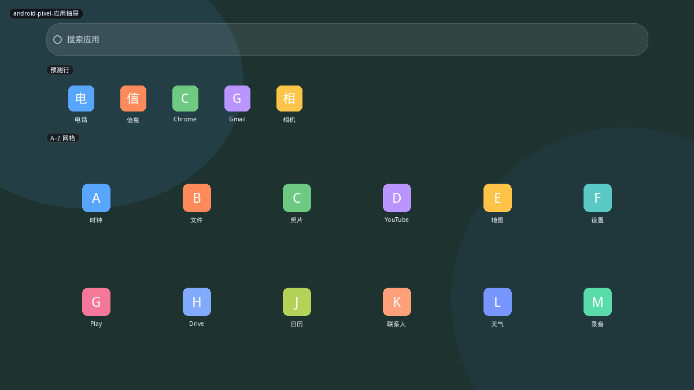
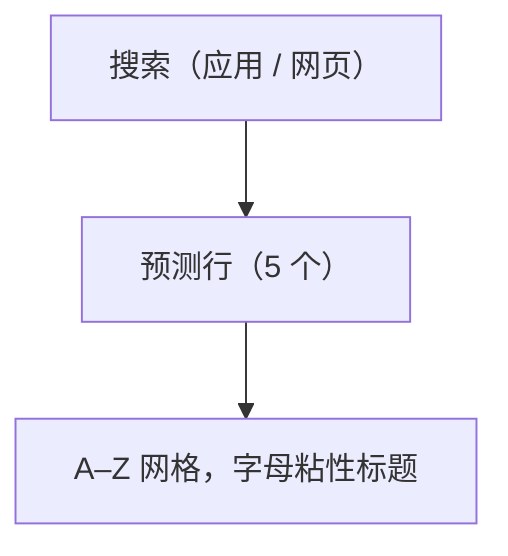
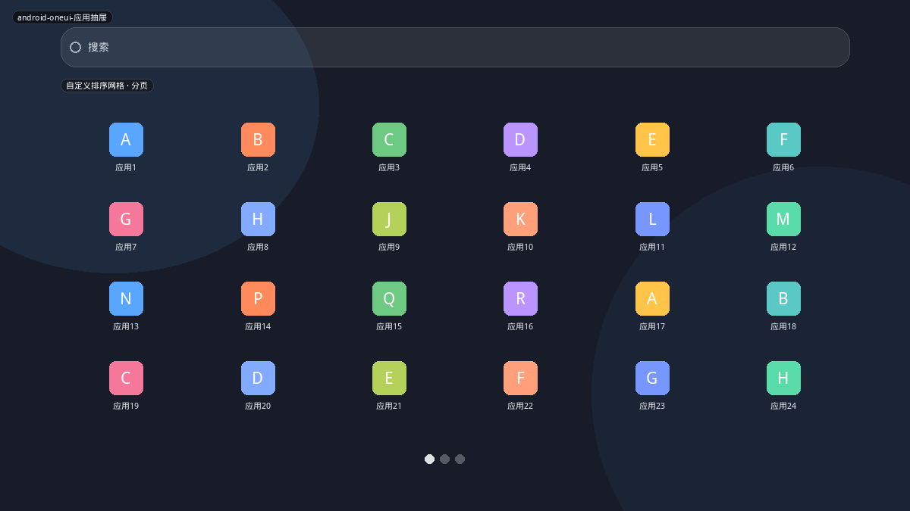
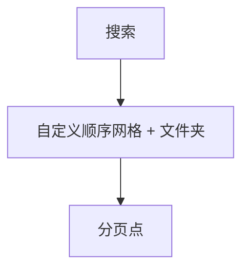
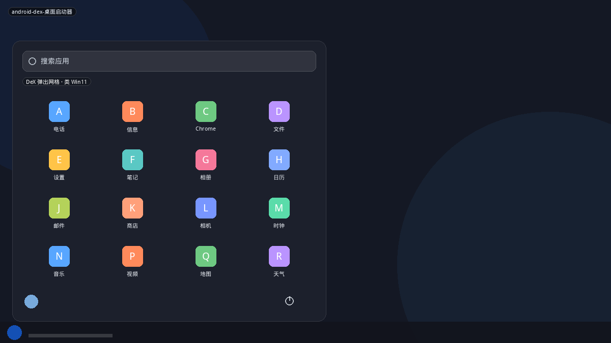
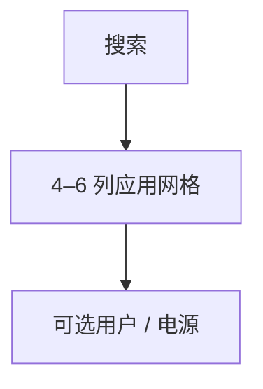

# Android / One UI / DeX

手机应用抽屉是近十年「开始菜单」改版最常引用的参照：少 chrome、字母网格、顶搜索、一行预测。平板和大屏上又分出 **One UI 自定义抽屉** 和 **DeX 桌面弹窗**。

## 变体一览

| 名称 | 形态 | 现有布局 |
|------|------|----------|
| `android-pixel-应用抽屉` | 预测行 + A–Z | `android-pixel` |
| `android-oneui-应用抽屉` | 自定义分页网格 | `android-oneui` |
| `android-dex-桌面启动器` | 桌面弹出网格 | `android-dex` |

---

## android-pixel-应用抽屉

主屏上滑。顶搜索（应用 + 网页建议），下一行 5 个预测/常用，主体按应用标签字母排序的网格。没有电源、没有用户头像、没有类别侧栏。

**功能设计**

- 预测来自使用频率与时间段（下班打开地图等），可关。
- 字母索引起点在右侧，滑动可跳转到 S、W…
- 文件夹主要在主屏，抽屉里也可以有，但 Pixel 默认更强调扁平 A–Z。
- 卸载、应用信息走长按；启动器不承载会话。

**可借鉴（建议作为 android 分类首个布局）**

- 结构极简：`LayoutSearchField` + 预测 `ShortcutRow` + `LayoutAppGrid` 按字母分组。
- 会话按钮不要出现在抽屉里；关机仍走面板或 Kickoff 其它布局。
- 触控友好：图标 ≥40px，行距松。

---

## android-oneui-应用抽屉

Samsung 默认抽屉可自定义顺序、分页、新建文件夹，不一定强制 A–Z。搜索在顶或底（版本而异）。更像「第二块主屏」。

**功能设计**

- 用户排序优先于系统分类——和 iPad 主屏类似，和 Pixel 抽屉相反。
- 平板上列数增加；折叠屏内外屏用不同列数。
- 与主屏的差别只是「是否允许小部件」。

**可借鉴**

- 对本项目，自定义排序 = 固定应用网格的全量版，和收藏模型冲突（全部都是「固定」）。
- 若做，用「用户顺序覆盖字母序」配置项即可，不必独立壳。

---

## android-dex-桌面启动器

DeX 把手机/平板变成类桌面：底任务栏，开始按钮弹出圆角应用网格，有搜索，有时有用户/电源。交互上更接近 Win11，而不是手机抽屉。

**功能设计**

- 鼠标优先，但触控仍可用（比 Windows 更宽容）。
- 应用是 Android 活动，窗口化由 DeX 合成器负责，启动器不管分屏。
- 任务栏另有最近应用，开始菜单不必再放「推荐文件」。

**可借鉴**

- 视觉可复用 `eleven` chrome，数据用全应用网格而不是「固定+推荐」。
- 适合作为 `az` 的「无固定区」模式，而不必叫 DeX。
