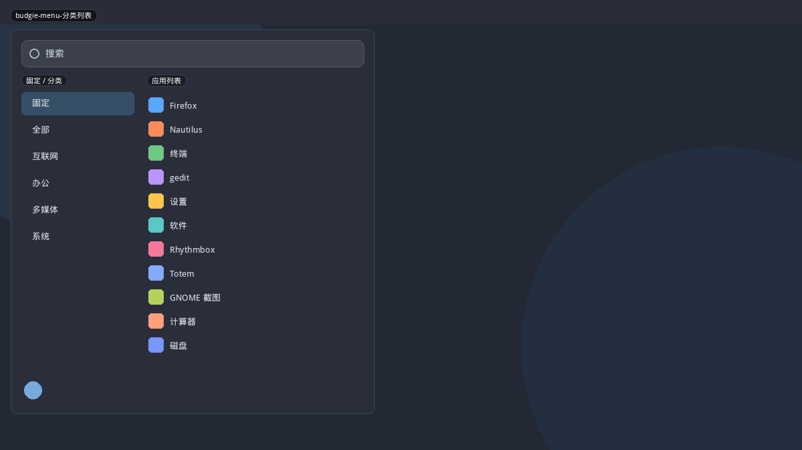
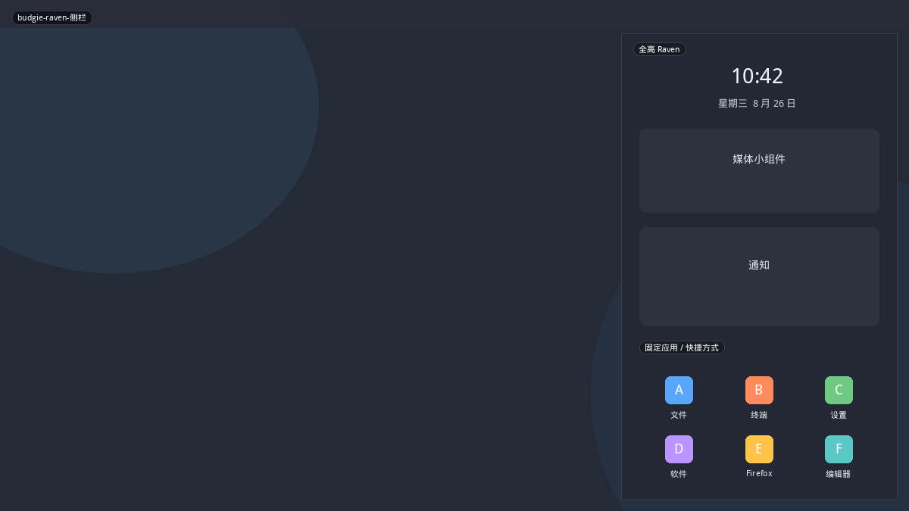
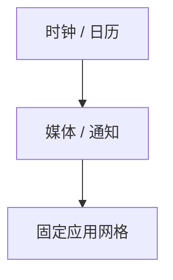

# Budgie

Budgie 默认应用菜单是紧凑的「搜索 + 侧分类 + 列表」，视觉接近 Whisker/Brisk。**Raven** 不是开始菜单，而是右侧全高通知/小组件抽屉；GNOME ArcMenu 的 Raven 布局借用了「全高侧栏」这个外形，把应用塞进去。本仓库 `budgie` 与 `raven` 应对齐这两种不同职责。

## 变体一览

| 名称 | 形态 | 现有布局 |
|------|------|----------|
| `budgie-menu-分类列表` | 弹窗分类菜单 | `budgie` |
| `budgie-raven-侧栏` | 全高右侧栏 | `raven` |

---

## budgie-menu-分类列表



顶栏或底栏按钮弹出。搜索置顶，左（或上）固定/全部分类，右应用列表。用户头像可放底。电源常不进菜单（走 Raven 或系统弹出）。

```mermaid
flowchart TB
  Search["搜索"]
  subgraph Body[""]
    Cat["固定 / 全部 / 分类"]
    List["应用列表"]
  end
  Search --> Body
```

**功能设计**

- 固定是一等分类，打开菜单先看见常用，而不是全部字母表。
- 键盘：方向键在分类列与应用列之间跳（社区一直要求把这点做完整）。
- 最近应用可作为虚拟分类。

**可借鉴**

- 现有 `budgie`：保证分类列可键盘到达；不要把电源硬塞底栏，除非设置打开。
- 与 `brisk` 极像（Solus 同源）。差异主要在：Budgie 更常挂顶栏、Brisk 更常底栏。

---

## budgie-raven-侧栏



屏幕右缘全高。日历/时钟、媒体、通知、小部件。ArcMenu 把它改成「图标轨 + 固定应用 + 快捷方式」，本仓库 `raven` 沿用该改编，而不是做通知中心。



**功能设计**

- 真 Raven：不列全部应用，启动不是它的工作。
- ArcMenu Raven：用全高解决「弹窗太矮」，应用与快捷方式可滚动。
- 世界时钟、媒体控件是可选 chrome，应用网格才是启动器部分。

**可借鉴**

- 现有 `raven` 已是全高。不要做成通知中心克隆（Plasma 已有系统托盘弹出）。
- 可借鉴真 Raven 的一点：顶部放**时钟或媒体**让侧栏不像「又一个 Kickoff」。现有 README 提到世界时钟，应对齐实现。
