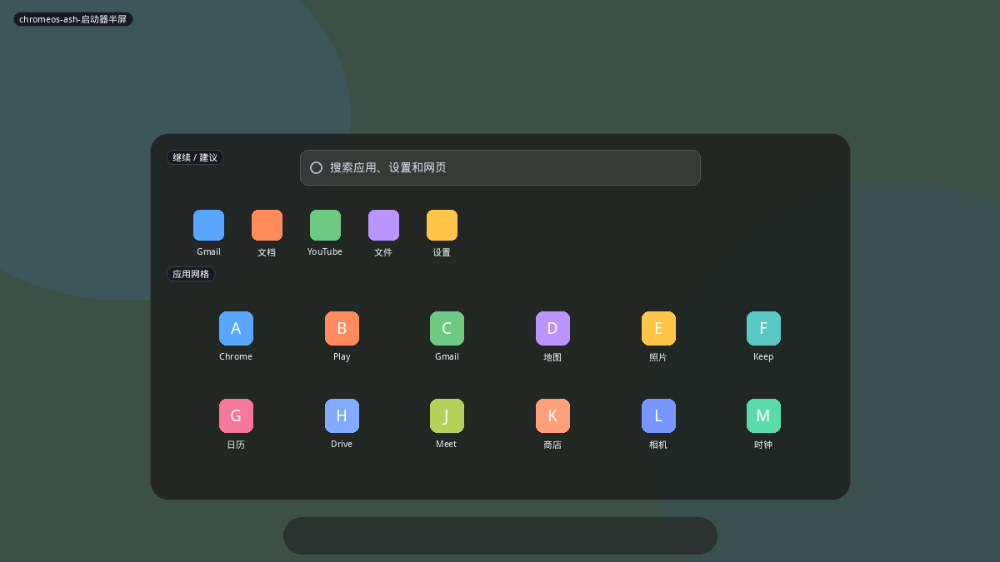
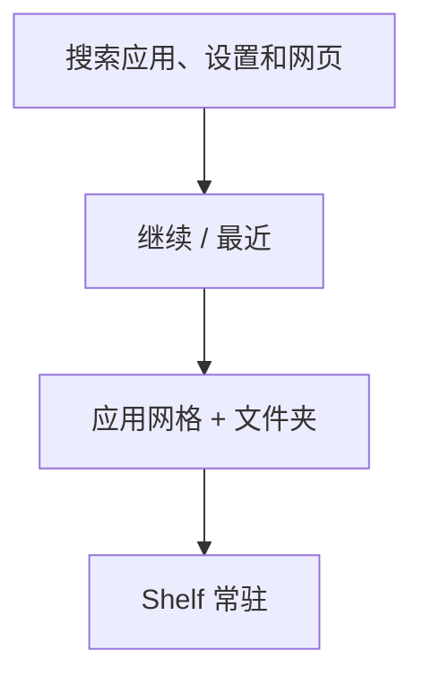
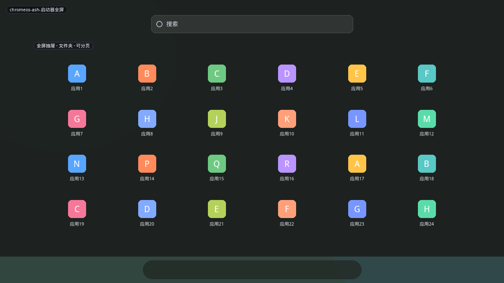
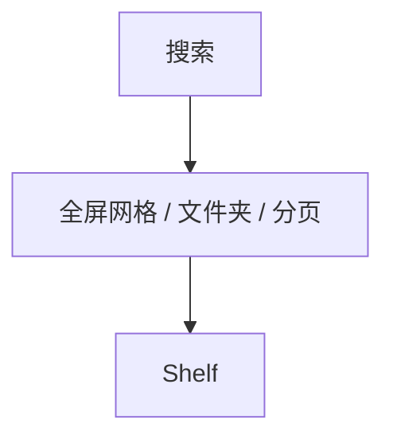
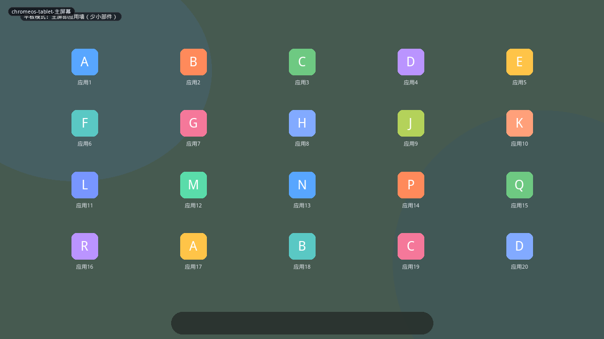
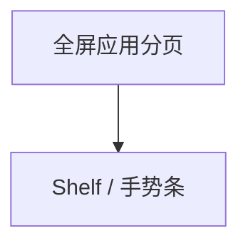

# ChromeOS

ChromeOS 的启动器挂在 **Shelf（货架）** 上，形态随桌面/平板模式切换。桌面模式是「从底边长出来的半屏搜索+网格」；拉满或平板模式变成接近 Android 的应用墙。

## 变体一览

| 名称 | 形态 | 现有布局 |
|------|------|----------|
| `chromeos-ash-启动器半屏` | 贴底半屏 | `chromebook` |
| `chromeos-ash-启动器全屏` | 全屏抽屉 | `chromeos-full` |
| `chromeos-tablet-主屏幕` | 平板应用墙 | `chromeos-tablet` |

---

## chromeos-ash-启动器半屏

点 Shelf 启动器或搜索键。圆角卡片从底部升起，约占屏幕下半。顶搜索（应用、设置、网页），中「继续/建议」，下为应用网格，可含文件夹。Shelf 仍露在外面。

**功能设计**

- 搜索是一等公民：ChromeOS 用户大量靠打字，网格是后备。
- 「继续」是跨设备/最近标签，类似 Win11 推荐，但更偏网页与文档。
- 半屏保证仍能看见当前窗口标题，不像 GNOME Overview 完全打断。
- 文件夹与 Android 类似，圆形或圆角盒。

**可借鉴**

- 改 `chromebook`：锚在面板内侧、**宽度接近屏幕、高度 50–60%**，而不是 420×620 肖像卡片。
- 增加「继续」行（最近应用/最近文档各 5 个）。
- 搜索应能落到设置项和网页（后者可用默认浏览器查询 URL）。

---

## chromeos-ash-启动器全屏

半屏上拖或点展开。网格变密、可分页，搜索仍在顶。用于应用很多或触控浏览。

**功能设计**

- 与半屏同一组件，只是高度约束放开——Deepin 也是这套「同一启动器可变尺寸」。
- 关闭手势：下扫或 Esc。

**可借鉴**

- `heightPolicy: available` + 用户拖高度。与 Deepin 窗口启动器可共用 resize 逻辑。

---

## chromeos-tablet-主屏幕

平板/分离键盘时，启动器往往不再是弹层，而是**主屏本身**：分页应用图标 + 底 Shelf，小部件能力弱于 Android/iPad。社区常批评它像「忘了做主屏的应用抽屉」。

**功能设计**

- 没有桌面图标与小部件时，主屏信息密度低，只适合少应用设备。
- 手势返回概览、分屏。

**可借鉴**

- 不必做默认桌面替换。若做「平板模式」，优先复用半屏启动器而不是铺满图标墙。
- 对 Plasma 平板：Kickoff 全屏 + 大图标即可，不必抄 ChromeOS 平板主屏。
