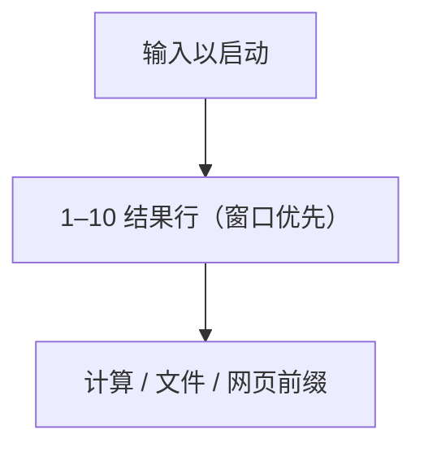
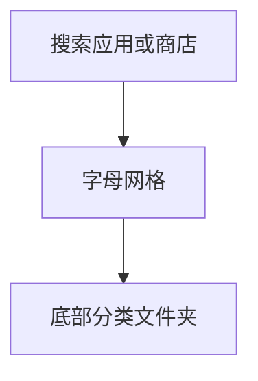

# Pop!_OS COSMIC

Pop!_OS 在 GNOME 时期用「应用库」网格；新 **COSMIC** 桌面把启动拆成两件：**Launcher（Super，搜索优先）** 和 **App Library（应用墙 + 底部分类文件夹）**。Launcher 把打开的窗口排在应用前面，并给前十个结果数字键——这是现有 `pop` 布局没有的交互。

现有 `pop` 更接近旧 Pop GNOME 应用库（搜索 + 六列 + 分类页签）。

## 变体一览

| 名称 | 形态 | 现有布局 |
|------|------|----------|
| `pop-cosmic-启动器搜索` | 居中列表 + 数字键 | **无（高优先）** |
| `pop-cosmic-应用库` | 字母网格 + 底文件夹 | `pop` 接近 |

---

## pop-cosmic-启动器搜索

Super。居中暗色卡片。输入即过滤。结果顺序：**已打开窗口 → 应用 → 其它**。每行左侧 1–10 快捷键。支持 `=` 计算、`find` 文件、搜索引擎前缀。

**功能设计**

- 启动器同时是窗口切换器：不必先 Alt+Tab。
- 数字键降低「结果里还要再方向键」的成本。
- 空查询也应列出窗口和常用应用，否则 Super 一下什么都没有。
- 不显示分类、固定网格、用户、电源。

**可借鉴（建议新布局 `cosmic` 或扩展 `runner`）**

- 与 KRunner 布局可共用浮层，差异在：
  - 窗口结果置顶
  - 可见数字徽章
  - 空查询填充
- Plasma 任务模型可提供窗口标题；Enter 聚焦窗口而不是再启动实例。

---

## pop-cosmic-应用库

独立「应用程序」库。顶搜索（可搜商店），中字母网格，**底部分类文件夹**（全部、办公、系统…）。点文件夹过滤网格。

**功能设计**

- 分类不占侧栏，把垂直空间留给图标——平板友好。
- 商店搜索出现在同一框，发现与启动合一（需能关掉）。
- 与 GNOME 应用网格相比：有明确类别入口，不只靠文件夹自定义。

**可借鉴**

- 现有 `pop` 用底页签，已经很接近。差在：COSMIC 底栏是**文件夹块**不是文字页签，空态更大、更好点。
- 商店结果默认关闭，避免 Unity Scope 式噪音。
