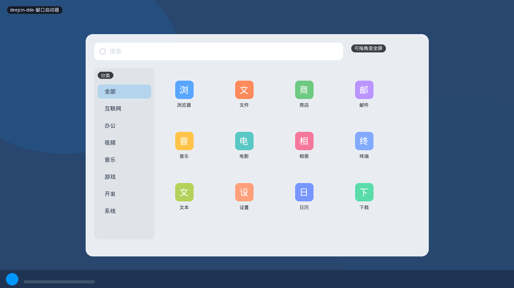
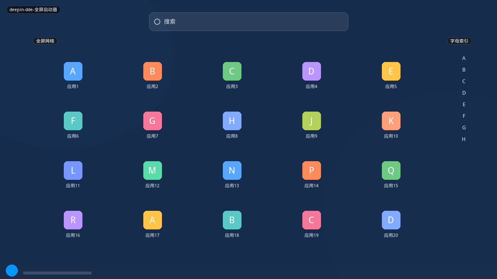

# Deepin DDE

Deepin / UOS 启动器有两种尺寸：**窗口模式**（分类侧栏 + 网格，可拖角落）和 **全屏模式**（大网格 + 右侧字母索引）。同一个启动器，拉满角落就切全屏。这比「设置里选全屏布局」更直接，也是 Budgie 社区常提到的优点。

## 变体一览

| 名称 | 形态 | 现有布局 |
|------|------|----------|
| `deepin-dde-窗口启动器` | 可缩放窗口 | `deepin-window` |
| `deepin-dde-全屏启动器` | 全屏+字母索引 | `deepin-full` |

---

## deepin-dde-窗口启动器



浅色或深色卡片。顶搜索，左分类（全部、互联网、办公…），右网格。右下角拖拽改大小；拖到接近全屏时切换模式。

```mermaid
flowchart TB
  Search["搜索"]
  subgraph Body[""]
    Cat["分类"]
    Grid["应用网格"]
  end
  Grip["拖角 → 尺寸 / 全屏"]
  Search --> Body --> Grip
```

**功能设计**

- 分类是过滤，不是进子页。
- 窗口模式适合「我还要看见桌面」；不必 Super 进全屏。
- 字母索引在窗口模式弱化，全屏才强调。
- 卸载可在启动器内完成（发行版特性），Plasma 应转到 Discover，不要内嵌卸装。

**可借鉴**

- 现有 `MenuResizeHandles.qml` 已能改宽高。缺的是 **阈值切全屏布局**：高度超过某比例时换 `plasma-dash` 式壳，或同一布局改列数。
- 新布局 `deepin`：左分类右网格，浅色默认，分类图标用系统类别。

---

## deepin-dde-全屏启动器



壁纸压暗。大图标网格，右侧 A–Z 索引条（点字母跳转）。搜索仍在顶。可缩回窗口模式。


**功能设计**

- 字母索引解决「应用极多」的中文桌面现实（一次安装几十个国产客户端）。
- 触控：索引条是一条热区，不必精确点某个字母。
- 与 Android 抽屉同源，但保留 Deepin 分类体系的切换入口。

**可借鉴**

- 任何全屏网格（`plasma-dash`、`elementary`、未来 `android`）都应能挂 **右侧字母条**，这是独立小组件，不是 Deepin 专用。
- 中文应用名按 `locale` 排序（拼音），不要只按 ASCII。
