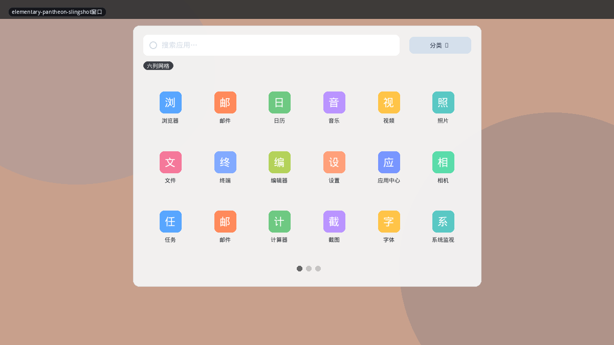
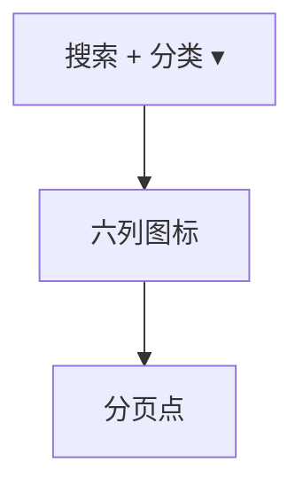
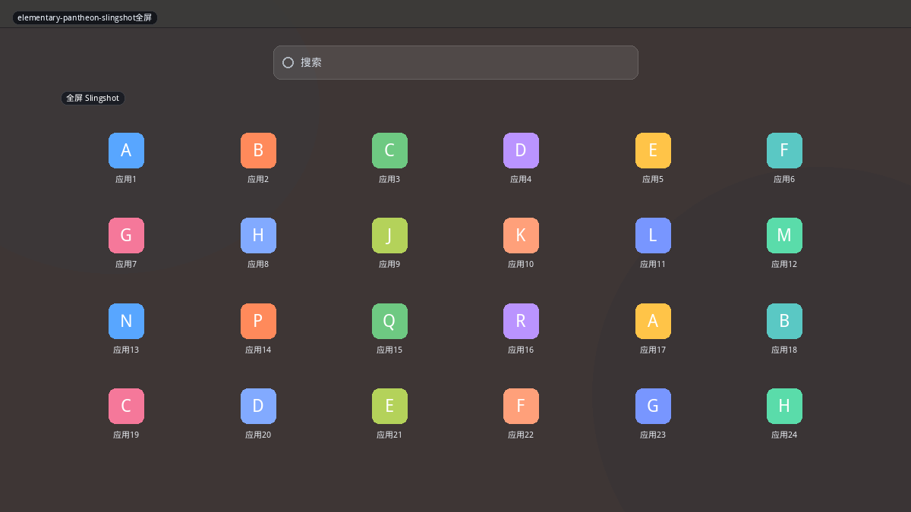
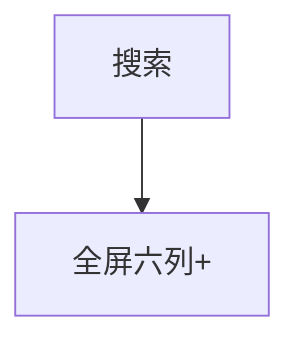

# elementary OS Pantheon

Pantheon 的启动器叫 **Slingshot / Applications**。默认是顶栏弹出的浅色大卡片：搜索 + 六列网格 + 分页点，可切到分类视图。也可全屏。它刻意不做电源、不做用户、不做推荐文件——「只启动应用」。

现有 `elementary` 布局已覆盖窗口网格。全屏是同一组件的高度策略，不必当成完全不同的产品。

## 变体一览

| 名称 | 形态 | 现有布局 |
|------|------|----------|
| `elementary-pantheon-slingshot窗口` | 浅色六列弹窗 | `elementary` |
| `elementary-pantheon-slingshot全屏` | 全屏网格 | `plasma-dash` 密度近似 |

---

## elementary-pantheon-slingshot窗口

从顶栏「应用程序」落下。浅色毛玻璃，顶搜索，可选「分类」下拉，主体 5–6 列图标，底部分页点。没有关机按钮。

**功能设计**

- 分类视图仍是网格，只是先选类——不是 Mint 那种永久侧栏。
- 分页降低「长滚动找不到」；应用少时只有一页。
- 会话在 elementary 的顶栏系统指示器，启动器不管。
- 搜索同时可找设置面板（Switchboard 插件）。

**可借鉴**

- 现有布局不要硬加电源，否则就不像 Pantheon。
- 分页点是相对 `pop` 底页签的另一种导航：页签=分类，点=同一集合的切页。

---

## elementary-pantheon-slingshot全屏

同一网格铺满，壁纸压暗。触控和演示场景。分类与搜索逻辑不变。

**功能设计**

- 应能从窗口模式一键放大（对比 Deepin 拖角）。
- 退出：Esc、再点顶栏、点空白。

**可借鉴**

- `elementary` 加 `heightPolicy: available` 开关即可，不必第二个 QML 文件。
