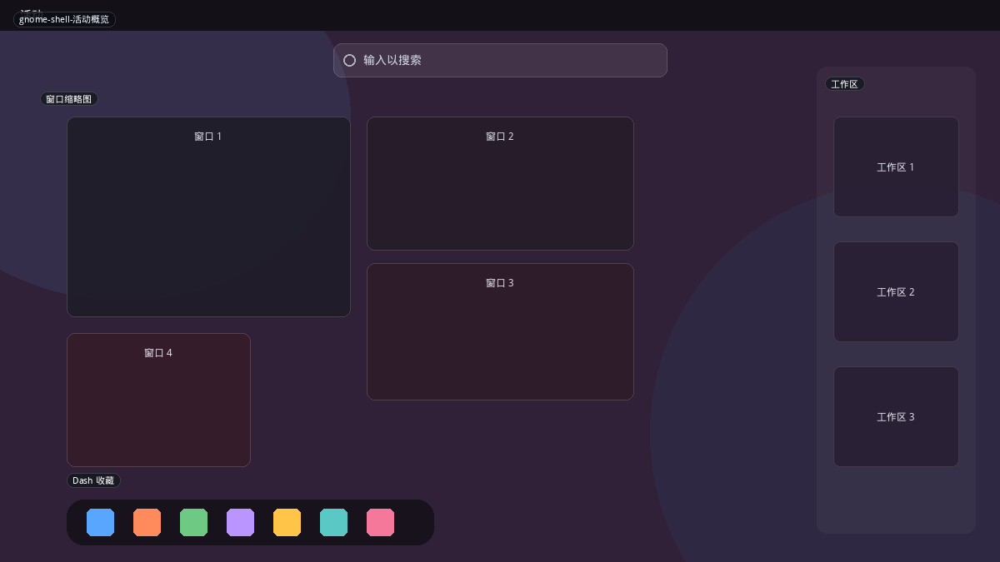
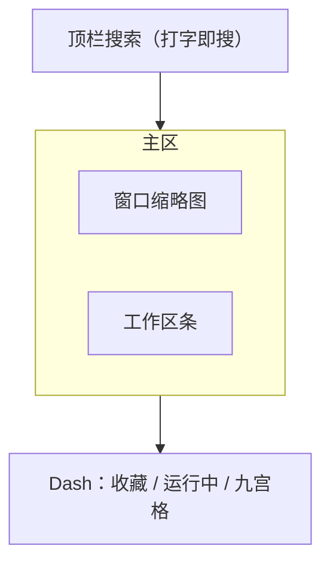
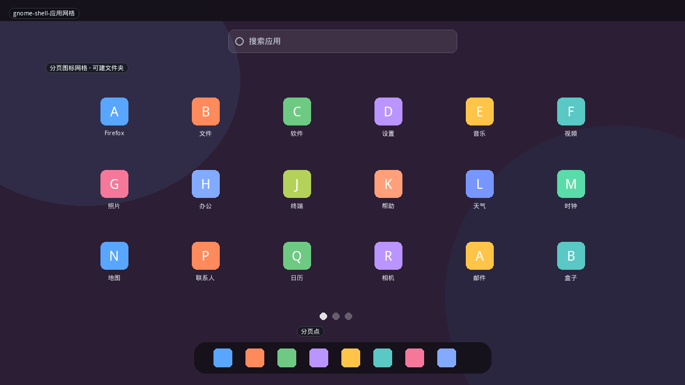
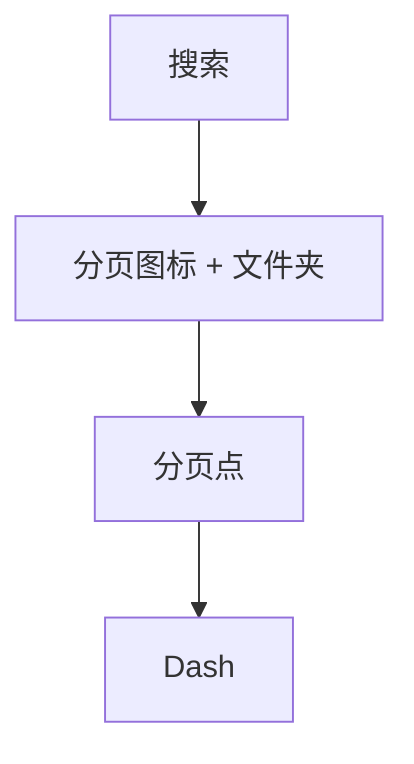
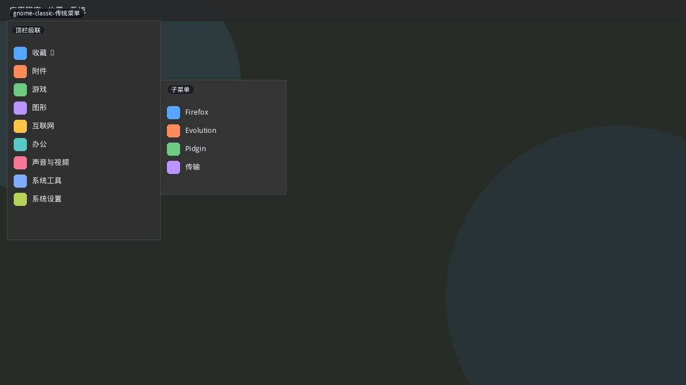
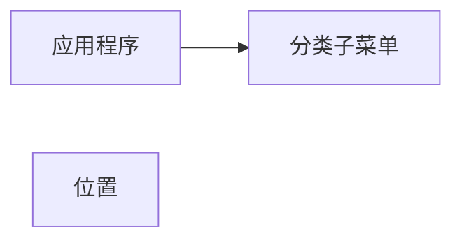

# GNOME Shell

GNOME 3 之后放弃「开始菜单」这个控件，改成 **Activities Overview（活动总览）**：启动应用、切换窗口、管理工作区是同一块全屏。应用墙是总览里的第二页（Dash 九宫格）。GNOME Classic 才把传统「应用程序」菜单请回顶栏。

对本项目，GNOME 的价值不是再做一张六列网格（`elementary` / `pop` 已有），而是 **Overview 把窗口当一等公民**——现有布局全都假设「菜单里只有未运行的应用」。

## 变体一览

| 名称 | 形态 | 现有布局 |
|------|------|----------|
| `gnome-shell-活动概览` | 窗口+工作区+Dash | `gnome-overview` |
| `gnome-shell-应用网格` | 全屏分页网格 | `gnome-grid` |
| `gnome-classic-传统菜单` | 顶栏级联 | `gnome-classic` |

GNOME ArcMenu 本身是第三方扩展，布局皮肤已在本仓库大量移植，不在此重复。

---

## gnome-shell-活动概览

Super 键或左上角「活动」。顶搜索，中部当前工作区窗口缩略图，右侧工作区条，底部 Dash（收藏 + 运行指示 + 应用网格按钮）。

**功能设计**

- **默认任务是切换，不是安装启动。** 已打开的窗口比应用图标更大。
- 搜索同时打应用、设置、文件、联系人；空查询不展示全部应用。
- 可把窗口拖到工作区条或 Dash 图标上（分屏/新窗口）。
- Dash 运行中应用有点；点图标 = 聚焦或新开，由设置决定。
- 没有电源按钮：会话在右上系统菜单。启动器不管关机。

**可借鉴（建议新布局 `overview`）**

- 需要窗口列表（`TaskManager` / `plasma-windowed` 或 KWin 脚本能力可能不够，可用 `Plasma5Support` 任务模型或简化为「当前虚拟桌面窗口卡片」）。
- 即使做不到拖到工作区，**上半窗口卡、下半收藏网格** 也已和所有现有布局不同。
- 电源可放右上，以符合 GNOME 习惯；Plasma 用户更熟底栏会话，做成可选项。

---

## gnome-shell-应用网格

从 Dash 九宫格进入。全屏分页图标，可建文件夹，顶搜索，底仍保留 Dash。较新的 GNOME 还有「频率 / 字母」过滤。

**功能设计**

- 文件夹是 3×3 预览的图标堆，点开再展开。
- 分页而不是无限长滚动（手机习惯）；滚动过快会跨页。
- 不展示类别侧栏——分类靠文件夹和搜索。
- 软件中心入口弱，发现新软件不在此页完成。

**可借鉴**

- 与 `elementary` 的差别：**分页 + 文件夹堆 + 底栏 Dash 仍在**。
- 若做，文件夹应能把 `.desktop` 拖进去，并写入配置，而不是只用 Kicker 类别。

---

## gnome-classic-传统菜单

GNOME Flashback / Classic：顶栏「应用程序 | 位置」，级联菜单。行为接近 Kicker 或旧 GNOME 2。

**功能设计**

- 菜单挂在顶栏，向下展开，不是面板按钮弹出的大卡片。
- 「位置」是书签与设备，和应用树并列。
- 搜索弱，依赖菜单浏览。

**可借鉴**

- 不必新布局。若面板在顶部，`kicker` 向下展开即是。文档价值在于：Classic 证明 **GNOME 用户里仍有一批要级联菜单**，Kickoff 不是唯一答案。
