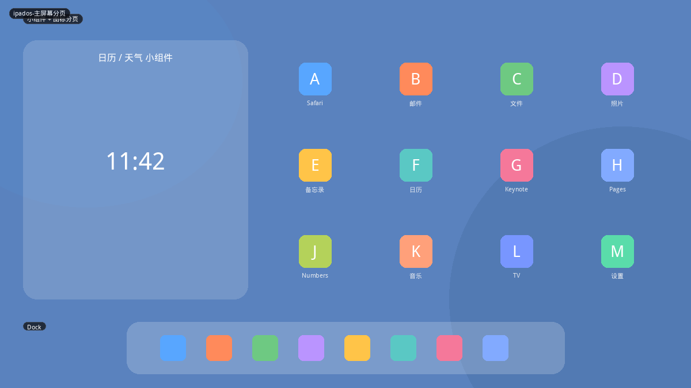
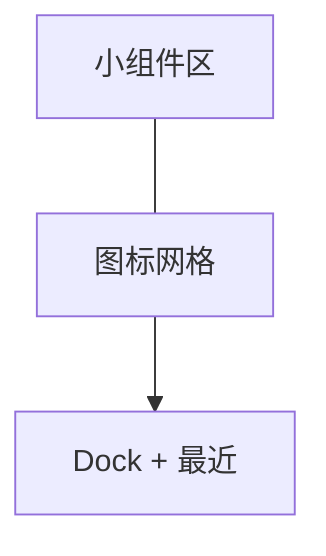
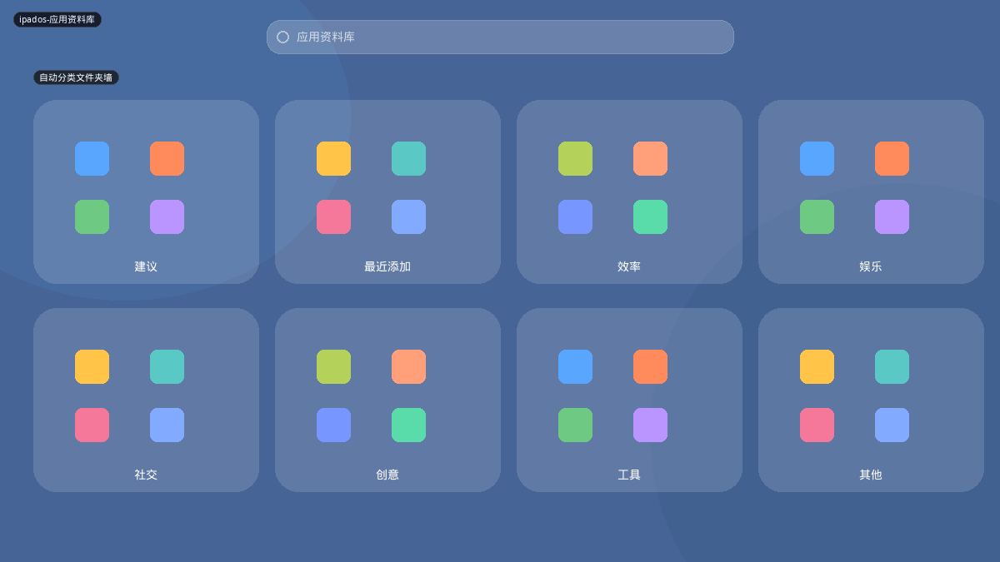
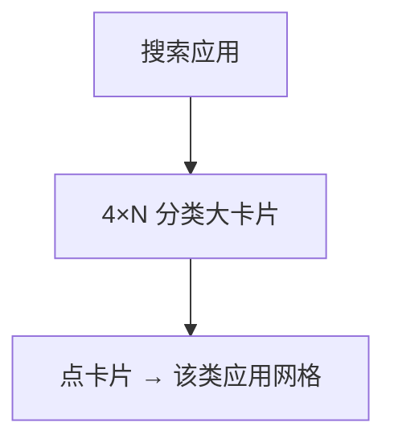
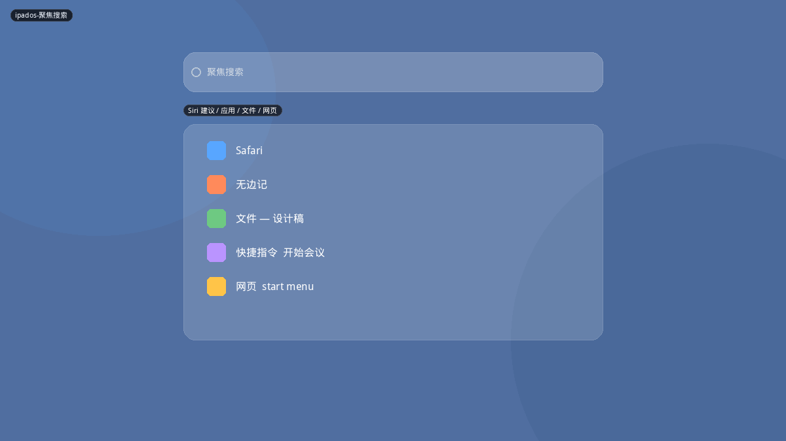
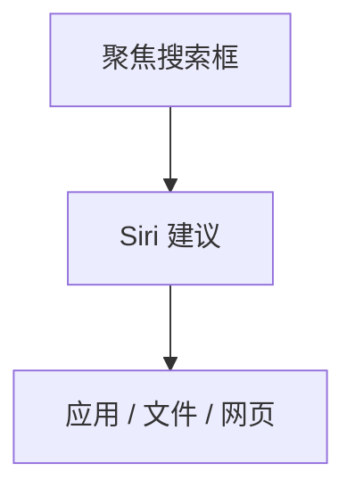

# iPadOS

iPad 把「所有应用」分成三层：**主屏幕（手动摆放 + 小部件）、应用资料库（系统自动分类）、聚焦搜索**。2025 的 Win11 分类视图明显在学 App Library，而不是学 Kickoff。这是本目录里对「布局太少」最有增量的平板参照。

## 变体一览

| 名称 | 形态 | 现有布局 |
|------|------|----------|
| `ipados-主屏幕分页` | 小部件+图标+Dock | 非菜单，桌面本身 |
| `ipados-应用资料库` | 自动分类文件夹墙 | **无（高优先）** |
| `ipados-聚焦搜索` | 下拉 Spotlight | 与 Runner 同类 |

---

## ipados-主屏幕分页

第一页常把 Today 小部件放左侧（尤其横屏），右侧为应用图标。底 Dock 常驻，可放最近使用。多页横滑。

**功能设计**

- 主屏是启动器也是工作台：时钟、日历、电池不必进菜单。
- Dock 是「真正的固定应用」；主屏图标是第二层固定。
- 不承担关机（没有桌面电源）。

**可借鉴**

- Plasma 桌面已有小部件，不必在菜单里复制主屏。
- 可借鉴 Dock 思路：菜单里的固定区应允许「钉到面板」，与主屏小部件分工。

---

## ipados-应用资料库

主屏最后一页（或 Spotlight 入口）。系统按用途自动装箱：建议、最近添加、效率、娱乐、社交、创意、工具… 每个箱子是大卡片，内嵌最多 4 个图标预览，点卡片展开该类全部应用。顶搜索。

**功能设计**

- **用户不维护分类。** 新装应用自动进「最近添加」和某个语义类。
- 「建议」随时间段变，类似 Pixel 预测行，但是卡片而不是单行。
- 搜索是资料库的真·主路径；卡片是「不想打字时的扫视」。
- 同一应用可出现在「建议」和「效率」两处，不要求互斥。

**可借鉴（建议新布局 `library`）**

- 用 Kicker 类别生成卡片：每类取 4 个最常用应用做封面。
- 卡片网格 3–4 列，点入后 `PageHost` 进该类应用页（已有 `ArcAppsPage` 可复用）。
- 「建议」卡片 = 收藏或最近启动；「最近添加」需要安装时间元数据（KService 不一定有，可用文件 mtime 近似）。
- 这比再做一套 Mint 侧栏分类**更不同**，也更贴近平板。

---

## ipados-聚焦搜索

主屏下拉。Siri 建议、应用、文件、网页、快捷指令。键盘弹出后是搜索优先，和桌面 Spotlight 同族。

**功能设计**

- 空查询就能给建议，不必先输入。
- 快捷指令出现在结果里，相当于「可搜索的系统动作」。

**可借鉴**

- 空查询展示收藏 + 最近，而不是空白，这点 Kickoff 默认收藏页已经在做。
- 系统动作（锁屏、睡眠）应能被搜索到——现有搜索若只匹配 `.desktop`，要补 session action 索引。
