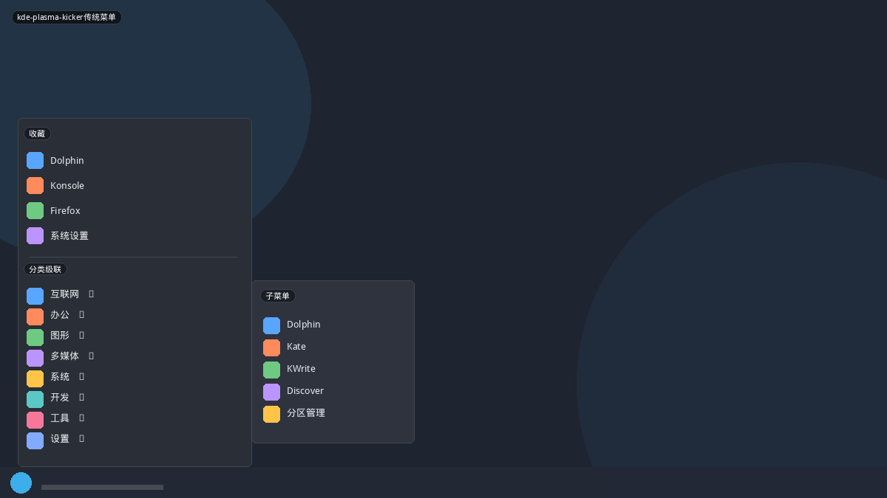
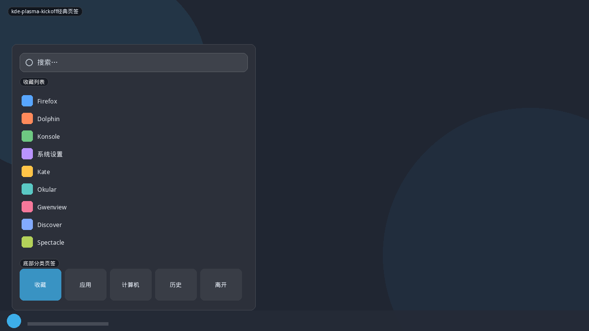
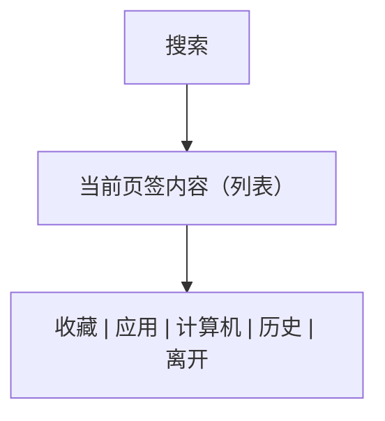
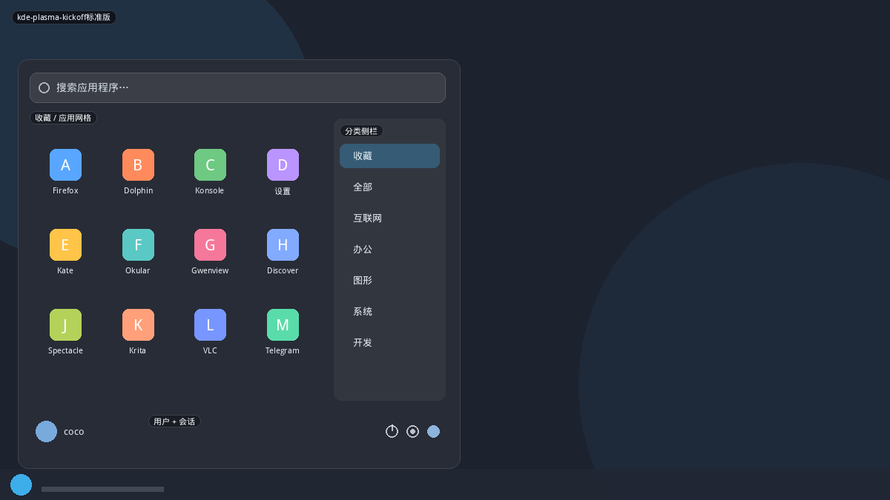
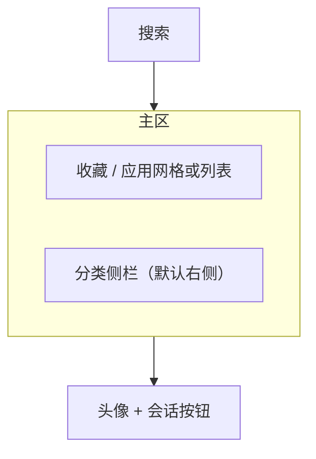
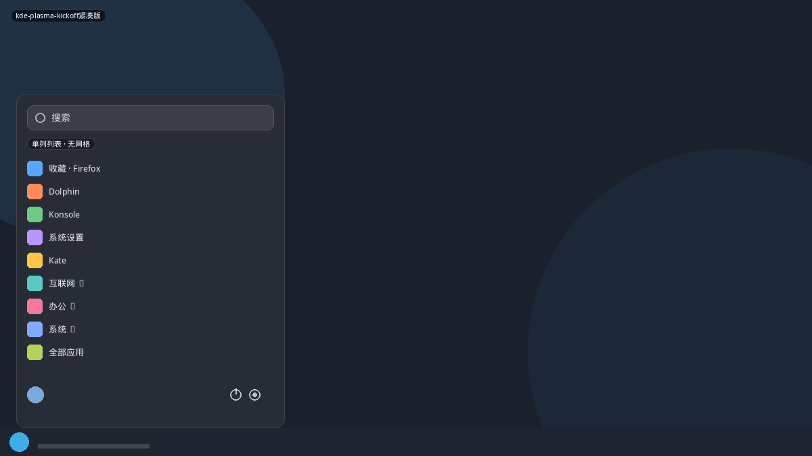
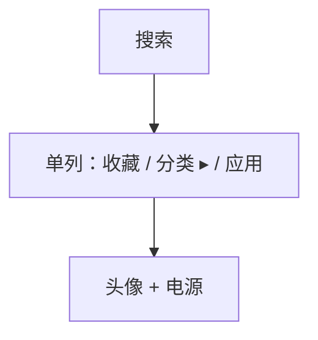
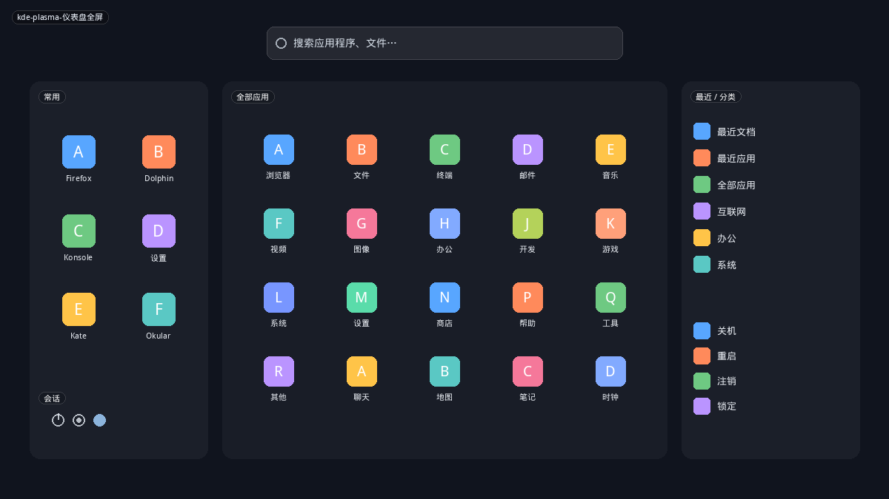
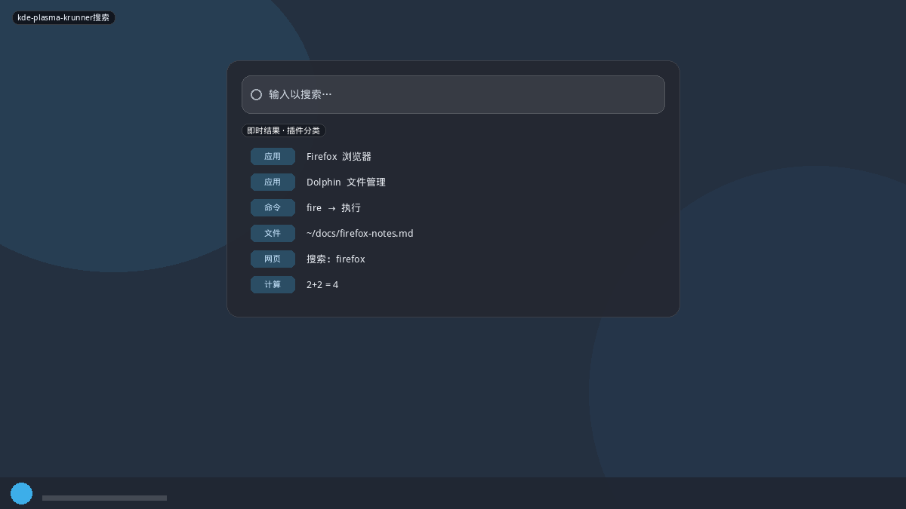
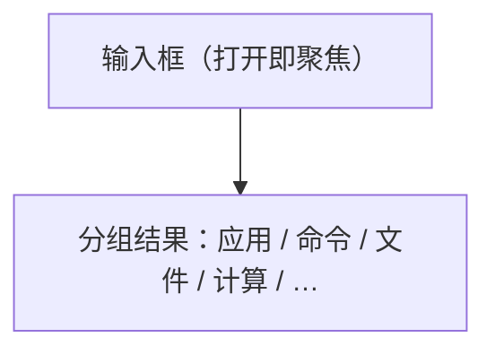

# KDE Plasma 启动器

Plasma 不把启动器做成单一「开始菜单」，而是同一套 Kicker 数据上的多种壳：**Kicker（级联）、Kickoff（弹窗）、Application Dashboard（全屏）、KRunner（搜索）**。本项目已经有 `kicker` / `kickoff` / `plasma` / `plasma-dash`，这里按**版本差异**拆开，避免把 Plasma 5.0 页签 Kickoff 和 Plasma 6 侧栏 Kickoff 当成同一个东西。

数据层共通：收藏、类别、最近文档、会话动作、KRunner 插件式搜索。差别几乎全在 chrome 和默认落点。

## 变体一览

| 名称 | 形态 | 现有布局 |
|------|------|----------|
| `kde-plasma-kicker传统菜单` | 级联 | `kicker` |
| `kde-plasma-kickoff经典页签` | 底栏五页签 | `plasma` 接近 |
| `kde-plasma-kickoff标准版` | 侧栏 + 网格 | `kickoff` |
| `kde-plasma-kickoff紧凑版` | 窄列表 | `kickoff-compact` |
| `kde-plasma-仪表盘全屏` | 三栏全屏 | `plasma-dash` |
| `kde-plasma-krunner搜索` | 居中 Runner | `runner` |

---

## kde-plasma-kicker传统菜单

面板上的 Application Menu。收藏在顶，分类向右飞出子菜单。占位小、路径短、适合「分类记忆」用户。

**功能设计**

- 悬停或点击展开；深层级用鼠标三角路径，不能误触关闭。
- 右键：收藏、添加到面板/桌面。
- 没有大搜索框时，KRunner（Alt+F2 / 打字）补搜索。
- Plasma 6 仍保留，作为 Kickoff 的正式替代项。

**可借鉴**

- 现有 `kicker` 要保证：**收藏置顶、子菜单不丢焦、键盘左右进入/退出**。不要做成假级联的双栏。

---

## kde-plasma-kickoff经典页签

Plasma 4 / 5.20 之前的 Kickoff：顶搜索，中内容，**底部分页签**（收藏、应用、计算机、历史、离开）。一次只看见一类信息。

**功能设计**

- 默认落在「收藏」：启动器按「常用」优化，而不是按分类树。
- 「计算机」= 位置（家目录、根、网络），「离开」= 会话，和应用列表彻底分开。
- 应用页内部再进分类，等于「页签 + 二级分类」，鼠标次数偏多——这是后来改侧栏的原因。
- 现有 `plasma` 布局（用户头 + 搜索 + 底栏四页签）就是这条线的 ArcMenu 化。

**可借鉴**

- 若保留页签 Kickoff，底栏页签必须**常驻且带图标**，电源不要只藏在「离开」里让人找不到。

---

## kde-plasma-kickoff标准版

Plasma 5.21 起重做、6.x 默认：搜索置顶，主区收藏/应用网格，**分类改侧栏**。Plasma 6 把侧栏放到右侧（左开菜单时，收藏离鼠标更近，避免穿过侧栏误切分类）。

**功能设计**

- 打开默认「收藏」。未配置收藏时，网格会空——需要空状态引导（「右键应用 → 添加到收藏」）。
- 分类切换：Plasma 6 默认**点击**而非悬停，防误触。可选项恢复悬停。
- 新安装应用在列表里高亮一段时间。
- 搜索走 KRunner 后端：应用、联系人、文档、会话动作同一结果流。
- 侧栏可随面板边缘镜像（右面板则侧栏在左）。

**可借鉴**

- 现有 `kickoff` 应对齐：**侧栏在内容外侧、收藏默认、搜索即 KRunner 语义**。
- `supportsFlip` 已有；应默认「侧栏远离面板按钮」，而不是永远在左。

---

## kde-plasma-kickoff紧凑版

同一 Kickoff 的窄窗、列表模式：无大图标网格，分类与应用同列或缩成二级。适合小屏、上网本、竖面板旁。

**功能设计**

- 宽度约 320–400px，高度随面板到屏幕边缘。
- 图标 24–32px，带描述文字可选。
- 分类用折叠或「进入子列表 + 返回」，不要再并排侧栏。

**可借鉴**

- 不必新 id：给 `kickoff` 加 `compact` 密度档（列数=1、隐藏侧栏）。布局目录里把它标成独立名称，方便设置页预览。

---

## kde-plasma-仪表盘全屏

Application Dashboard：全屏三栏。左收藏（含会话），中全部应用大网格，右最近与分类。搜索顶栏居中。触控和「我想看见一切」用户的方案。

**功能设计**

- 背景用桌面壁纸 + 暗遮罩，而不是另造一块纯色。
- 列数随宽度增加（现有 `plasma-dash` 的 `heightPolicy: available` 方向正确）。
- 搜索覆盖三栏，结果可按类型分段。
- Plasma 6 上游一度讨论移除 Dashboard；社区依赖仍在。本项目保留它是差异化，不是过时。

**可借鉴**

- 现有实现已有三栏骨架。对照点：左栏底部会话、右栏「最近文件」不只是最近应用、中间网格要虚拟化。

---

## kde-plasma-krunner搜索

全局启动器，不是面板菜单。默认屏幕上方居中：一条输入，下面按插件分组的结果（应用、命令、文件、网页、计算、窗口、spell、kill …）。

**功能设计**

- 快捷键唤起（Alt+F2 / 自定义），不必点面板。
- 第一条结果 Enter 即执行；Tab / 方向键在分组间跳。
- 计算、单位换算、kill 进程等是「菜单布局」做不到的，除非接入同一 runner。
- 视觉极简：无分类侧栏、无固定网格、无用户头像。

**可借鉴（建议新布局 `runner`）**

- GNOME ArcMenu 有 Runner 布局，本仓库没有。
- 实现要点：居中浮层、`PlasmaCore`/`KRunner` 结果模型、无固定尺寸网格。
- 与菜单型布局互补：Kickoff 负责浏览，Runner 负责「我已知道名字」。
