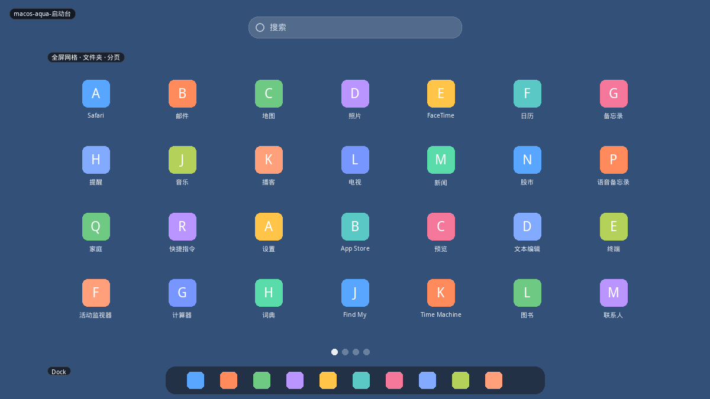
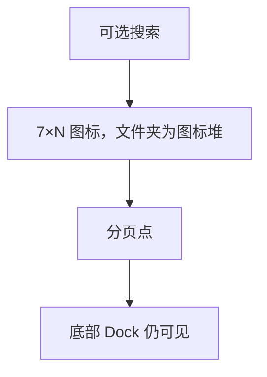
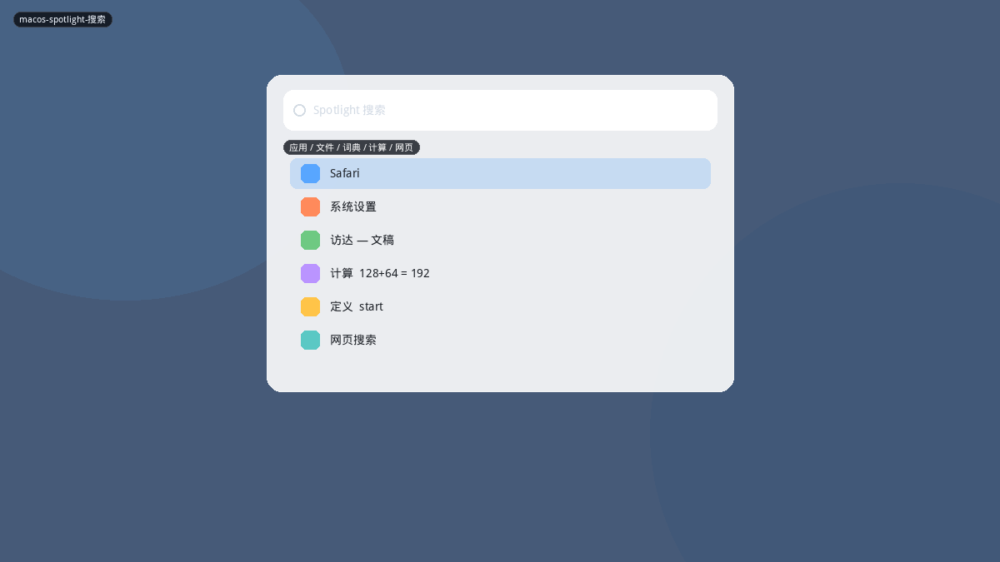
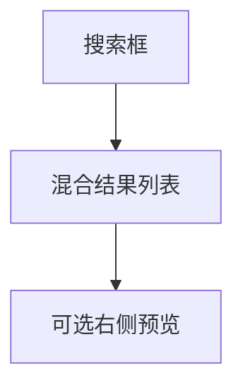
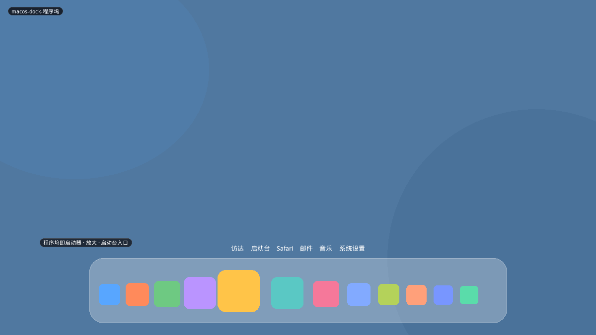

# macOS

macOS 没有 Windows 式开始菜单。启动被拆成三件套：**Dock（常驻启动）、Launchpad（全屏应用墙）、Spotlight（搜索）**。本项目若只做「面板弹窗」，会漏掉苹果这套「常驻坞 + 按需全屏 + 全局搜索」的分工。

## 变体一览

| 名称 | 形态 | 现有布局 |
|------|------|----------|
| `macos-aqua-启动台` | 全屏分页网格 | `elementary` 全屏近似 |
| `macos-spotlight-搜索` | 居中搜索 | **无（与 KRunner 同类）** |
| `macos-dock-程序坞` | 底栏放大坞 | 面板本身，不是菜单 |

---

## macos-aqua-启动台

F4 / Dock 里的 Launchpad 图标。壁纸模糊，图标 7×5 左右一页，底部分页点，可叠文件夹。较新版本顶部有搜索。

**功能设计**

- 文件夹：一堆图标缩进圆角盒，点开放大到屏幕中央。
- 拖拽分页、拖进文件夹；长按抖动删除（从 Launchpad 删 ≠ 卸应用，这点常让人困惑）。
- 没有类别侧栏、没有电源、没有「推荐文件」。
- 应用多时靠搜索或翻页，发现性差、扫视性好。

**可借鉴**

- 与 `elementary` / `plasma-dash` 比，Launchpad 的辨识度是 **文件夹堆 + 分页点 + 模糊壁纸**。
- Plasma 卸装走 Discover，不要做「抖动删除」。
- 适合作为 `searchGrid` 家族的 macOS 密度变体（更大图标、更少 chrome）。

---

## macos-spotlight-搜索

Command+Space。屏幕中上部一条搜索，结果按类型混排：应用、文档、定义、计算、剪贴板、网页建议。选中项右侧可有预览。

**功能设计**

- 系统级，不隶属任何面板菜单。
- 第一条通常是最佳应用匹配，Enter 启动。
- 与 Launchpad 分工：记得名字用 Spotlight，不记得才翻墙。

**可借鉴**

- 与 `kde-plasma-krunner搜索` 做**同一布局的两种皮肤**即可，不必两套逻辑。
- 浅色毛玻璃 + 右侧预览是 macOS 差；KRunner 默认无预览。

---

## macos-dock-程序坞

屏幕边缘常驻图标列，鼠标悬停放大，运行中有指示点，分隔线区分应用与堆栈/废纸篓。Launchpad、访达是坞上的固定公民。

**功能设计**

- 这不是弹窗菜单：启动路径是「点坞」而不是「开菜单再点」。
- 放大曲线让目标变大，补偿一维图标列的瞄准难度。
- 隐藏/自动隐藏改变可用热区。

**可借鉴**

- 不要在 plasmoid 里仿一个 Dock。Plasma 已有任务管理器、图标-only 任务栏。
- 可借鉴的只有：**固定应用应允许「钉到面板」作为一等操作**（Kickoff 右键已有「添加到面板」）。
