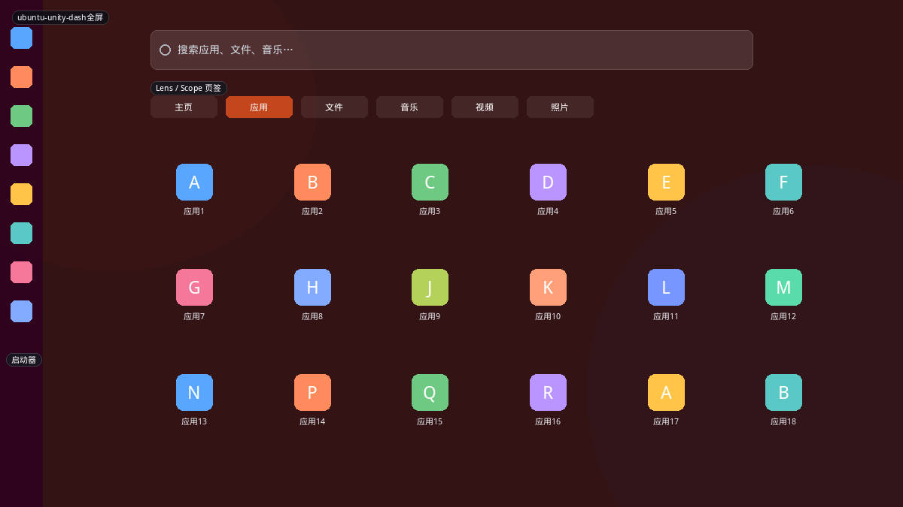
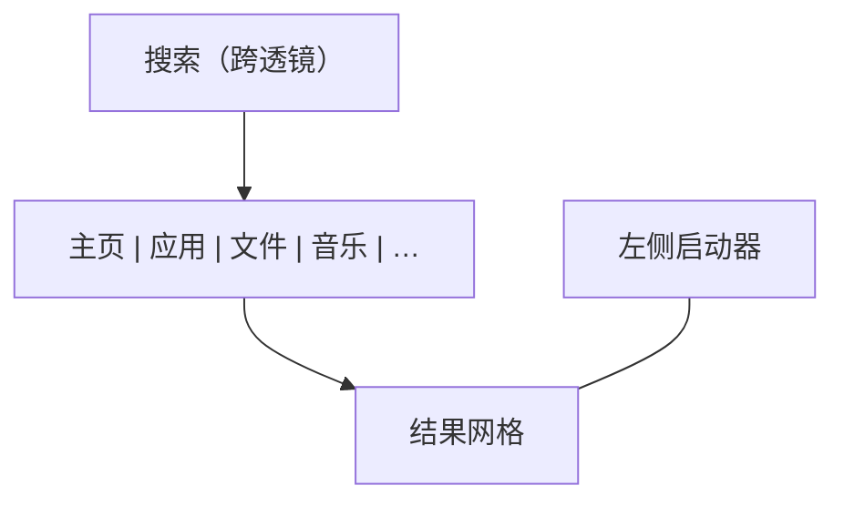
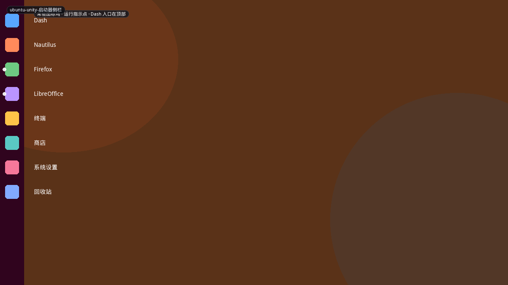
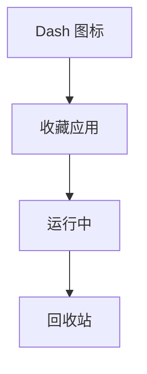

# Ubuntu Unity

Unity 7 把启动拆成 **左侧 Launcher（常驻）+ Dash（全屏搜索透镜）**。Dash 不是分类菜单，而是按 Lens（应用、文件、音乐…）分段的搜索 UI。本仓库 `unity` 是紧凑弹窗，`unity-dash` 是全屏网格，都只覆盖了外形，透镜/Scope 模型没有。

## 变体一览

| 名称 | 形态 | 现有布局 |
|------|------|----------|
| `ubuntu-unity-dash全屏` | 透镜全屏搜索 | `unity-dash` 外形 |
| `ubuntu-unity-启动器侧栏` | 常驻图标坞 | 面板/任务栏 |

---

## ubuntu-unity-dash全屏

Super 或 Launcher 顶图标。左 Launcher 仍在。顶搜索，下是 Lens 页签（主页、应用、文件、音乐、视频、照片），内容为结果网格。主页透镜混合最近与建议。

**功能设计**

- 空查询在「主页」给建议，在「应用」给已装应用。
- 在线 Scope（购物、社交媒体）曾经把 Dash 变成广告墙，是 Unity 被批评最多的点——**不要学在线源默认开启**。
- HUD（另通道）搜当前窗口菜单，不是 Dash 的一部分。
- 过滤器（类别、评分）在透镜右侧，Power User 用，新手不理。

**可借鉴**

- `unity-dash` 可加**底部分类页签**（现有 `pop` 已有页签），比再造 Scope 总线现实。
- 搜索源白名单：应用、文件、设置。默认关闭网页/商店。

---

## ubuntu-unity-启动器侧栏

左缘常驻：Dash 入口、收藏应用、运行中（即使未收藏也会出现）、回收站。左侧小点表示窗口数。可自动隐藏。

**功能设计**

- 启动器解决「固定应用」，Dash 解决「其余一切」。菜单不必同时承担两件事。
- 运行指示让它也是任务栏，和 Windows 任务栏+开始菜单的分工类似。

**可借鉴**

- 不要在 plasmoid 里画一条假 Launcher。Plasma 面板 + 图标任务管理器已经是这件事。
- 布局上的启示：`unity` 紧凑菜单应假设**固定应用已经在面板上**，菜单里少放重复图标，多放「全部应用 / 位置 / 会话」。
