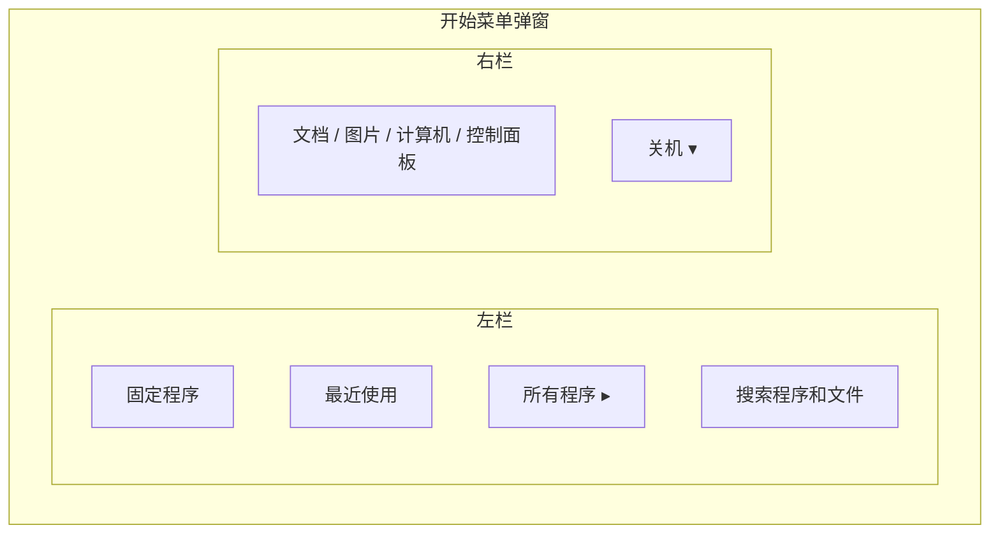
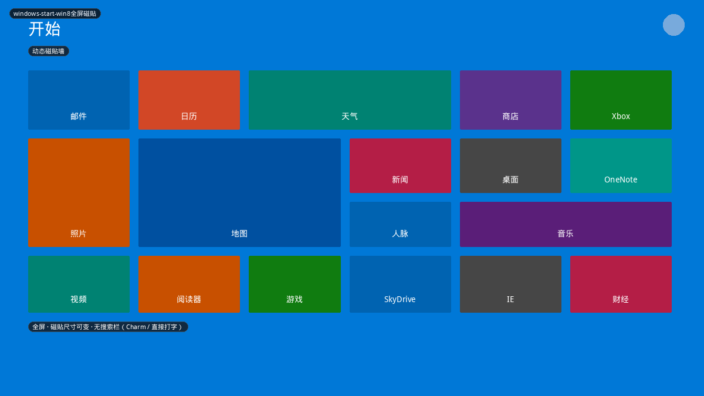
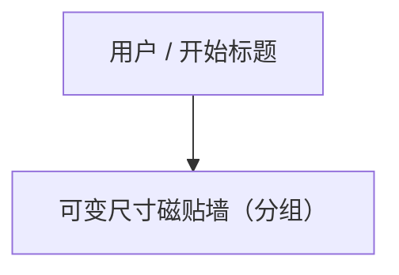
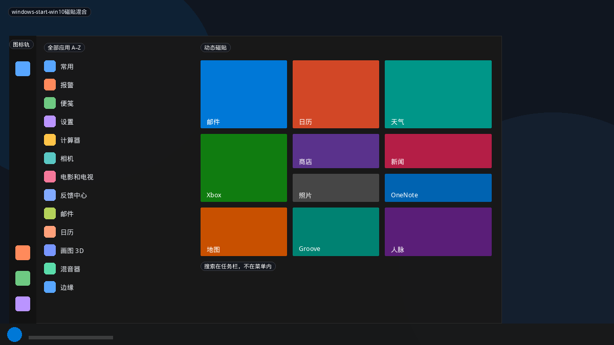
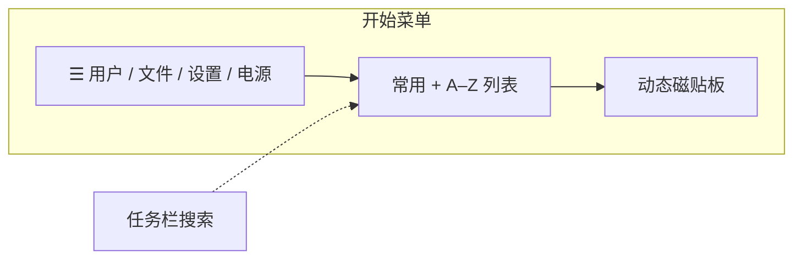
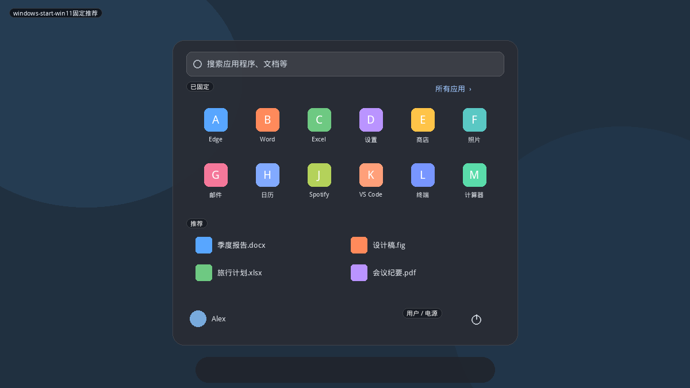
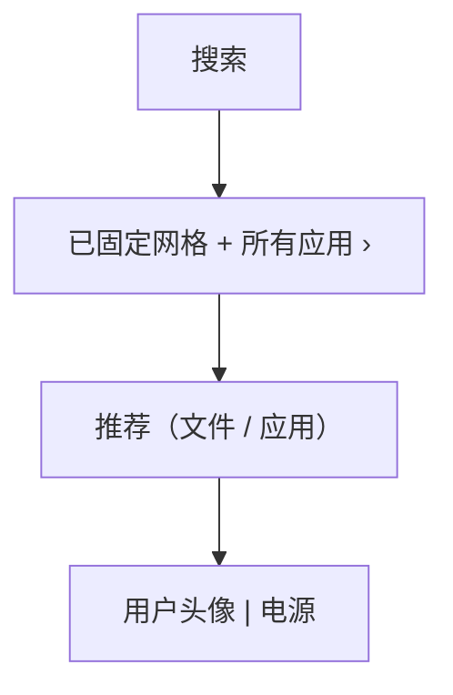
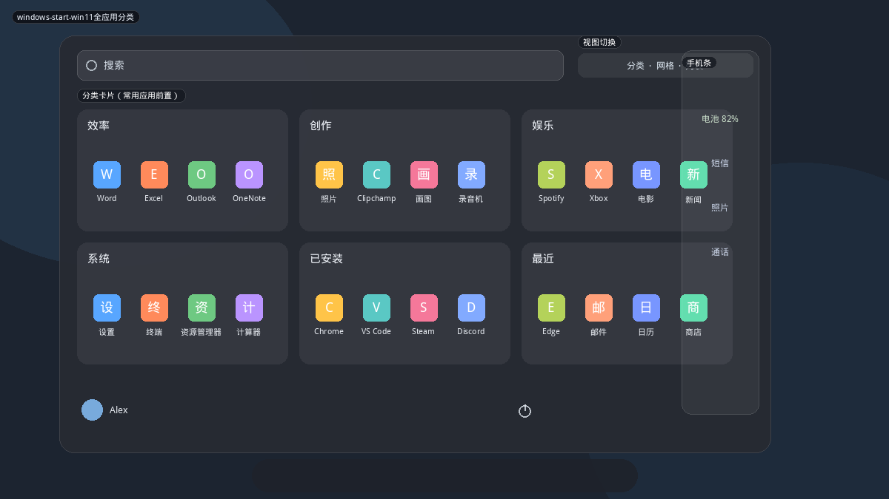
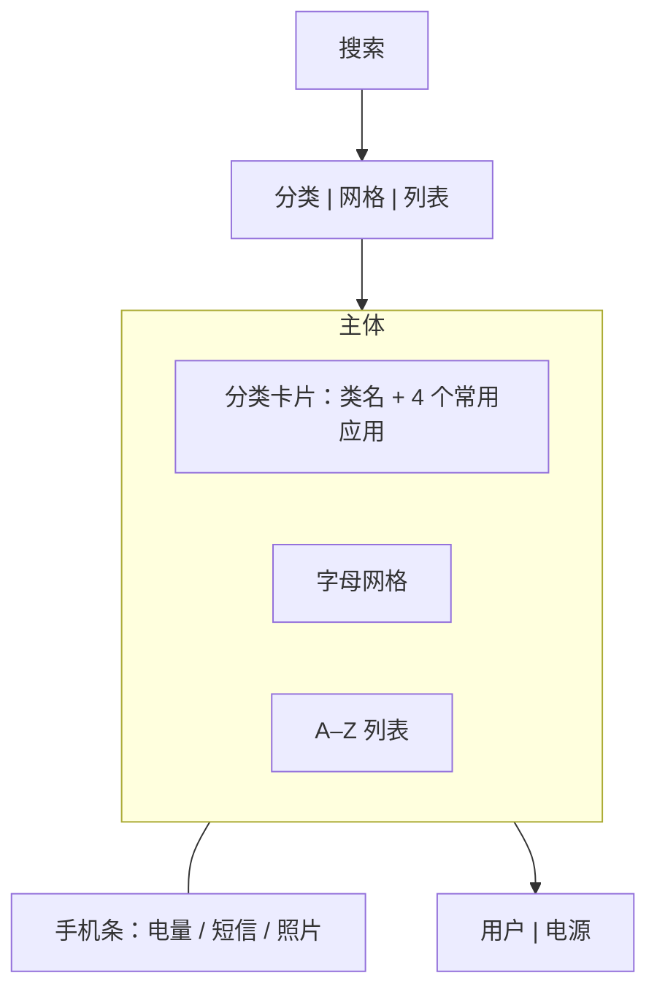
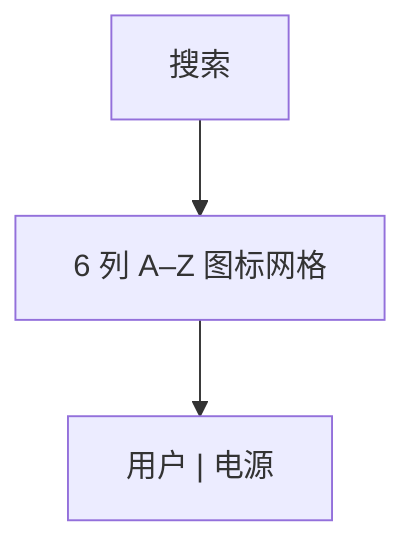

# Windows 开始菜单

Windows 的开始菜单是「桌面启动器」里被模仿最多的一条线：从 XP/7 的双栏，到 8 的全屏磁贴，到 10 的列表+磁贴，再到 11 的固定网格，以及 2025 把「所有应用」抬到顶层。对本项目，它提供的不是皮肤，而是**信息架构怎么换代**。

搜索在 Win7 进入菜单内部，Win10 被抽到任务栏，Win11 又回到菜单顶部——同一功能会在「菜单内字段 / 系统级搜索」之间搬家。

## 变体一览

| 名称 | 年代 | 原型 | 现有布局近似 |
|------|------|------|----------------|
| `windows-start-win7双栏` | Win7 / Vista | B 双栏 | `redmond` |
| `windows-start-win8全屏磁贴` | Win8 / 8.1 | F 全屏 | 无 |
| `windows-start-win10磁贴混合` | Win10 | E 列表+磁贴 | `windows` |
| `windows-start-win11固定推荐` | Win11 21H2–24H2 | D 固定+推荐 | `eleven` |
| `windows-start-win11全应用分类` | Win11 2025 | J 自动分类 | **无（高优先）** |
| `windows-start-win11紧凑网格` | Win11 2025 可配 | I 抽屉 | `az` 部分接近 |

WinXP 与 Win7 同属双栏（左常用 + 右位置 + 底栏「所有程序」），不单列预览。Vista 把搜索条做进左栏底部，Win7 沿用。

---

## windows-start-win7双栏

锚定在任务栏左下。左栏是「人」：固定程序、最近程序、所有程序、搜索。右栏是「地」：用户文件夹、计算机、控制面板、设备和打印机。关机是右下角主按钮，带弹出菜单。

**功能设计**

- 打开即焦点在搜索；不点分类也能打字启动。
- 「所有程序」把左栏换成可滚动树，右栏保持，避免整页跳走。
- 右栏条目按「位置」而不是「应用分类」，和 Kickoff 的 Applications/Places 分法同源。
- 关机是显式主操作，不是挤在图标轨里的第 5 个图标。

**可借鉴**

- 现有 `redmond` 已是网格化双栏。真正的 7 味在于：**左列表 + 右地点 + 底部搜索**，不要把右栏做成第二列应用。
- 「所有程序」用**同栏替换**而不是新页面，适合键盘用户。

---

## windows-start-win8全屏磁贴

取消桌面弹窗，开始屏幕即启动器。磁贴有小/中/宽/大四档，可分组、可显示实时内容。搜索靠直接打字或 Charm。桌面本身变成一块磁贴。

**功能设计**

- 触控优先：大热区、全屏扫动、分组标题。
- 动态内容（日历下一事件、天气）让磁贴不只是图标。
- 「所有应用」是另一全屏列表，从底边滑入。
- 失败教训：鼠标用户找不到关机、找不到桌面，导致 Win8.1 补回开始按钮。

**可借鉴**

- 不要做默认布局。若做，必须：**磁贴尺寸可改、分组、一键回桌面、电源不藏**。
- 可变尺寸网格是现有 `eleven` / `windows` 都没有的能力。

---

## windows-start-win10磁贴混合

Win8 全屏退回弹窗，但保留磁贴。左：汉堡图标轨 + 最常用 + A–Z 全部应用。右：可调整的 Live Tile 板。搜索在任务栏（Cortana / 搜索框），菜单内通常没有独立搜索条。

**功能设计**

- 汉堡展开后，左轨变成「地点 + 电源」全高菜单，对应现有 `windows` 的 `02-hamburger-menu`。
- 磁贴仍可缩放、分组，但在弹窗里密度过高，小屏幕只能纵向滚动。
- 「最常用」和 A–Z 同列，靠字母索引跳转。

**可借鉴**

- 现有 `windows` 布局已覆盖骨架。缺口是：**磁贴不是等大图标**；若要更像 Win10，网格单元要支持 1×1 / 2×1 / 2×2。

---

## windows-start-win11固定推荐

居中、圆角、留白。默认不是「全部应用」，而是：搜索 → 已固定 → 推荐文档/应用 → 用户与电源。全部应用是右上角二级页。

**功能设计**

- 设置可调「更多固定 / 均衡 / 更多推荐」，改变两块的高度比。
- 推荐依赖云账号与最近文件；可关。关掉后菜单立刻变空，必须靠固定或「所有应用」。
- 电源与用户在底栏，符合「先启动、后关机」的视觉权重。
- 任务栏居中时，菜单也居中；左对齐任务栏时应跟着锚点走。

**可借鉴**

- 现有 `eleven` 已是此结构。补强点：固定区行数可配、推荐可关、居中/锚点跟随面板。

---

## windows-start-win11全应用分类

2025 改版（KB5067036 一带）丢掉「固定 | 所有应用」两截。所有应用回到顶层，提供三种浏览：**分类卡片、字母网格、A–Z 列表**。大屏菜单变大；右侧可滑出 Phone Link「手机条」。

**功能设计**

- **分类视图**：每张卡片是一个自动类（效率、娱乐、系统…），卡片内按使用频率排序，避免「打开分类再滚动」。这是对手机应用抽屉和 iPad App Library 的桌面化。
- **网格 / 列表**：给「我知道名字、想扫一眼」的用户。
- 固定仍可存在，但不再是唯一主页。
- 手机条默认收成窄条，展开不挤掉搜索。
- 菜单宽度随屏幕变，不再死守 600px 居中方块。

**可借鉴（建议作为下一布局）**

- 新布局 id 可叫 `eleven-categories` 或 `windows-categories`。
- 需要：分类聚合（可复用 Kicker 类别）、卡片组件、视图切换、可选右侧信息条。
- Plasma 没有 Phone Link，右侧条可改成：**剪贴板 / 最近文件 / 设备电量 / 通知摘要**。

---

## windows-start-win11紧凑网格

同一 2025 菜单关掉推荐、选用网格视图后的形态：搜索 + 密铺字母网格 + 底栏用户/电源。非常接近 Android 应用抽屉。

**功能设计**

- 目标是「一眼看见全部」，不是发现推荐内容。
- 字母索引或悬停滚动条按字母跳转。
- 现有 `az` 更像「固定 + 全部应用列表」，不是纯网格抽屉。

**可借鉴**

- 给 `az` 增加「仅网格、无固定」模式，或新布局 `android` 家族的第一项。
