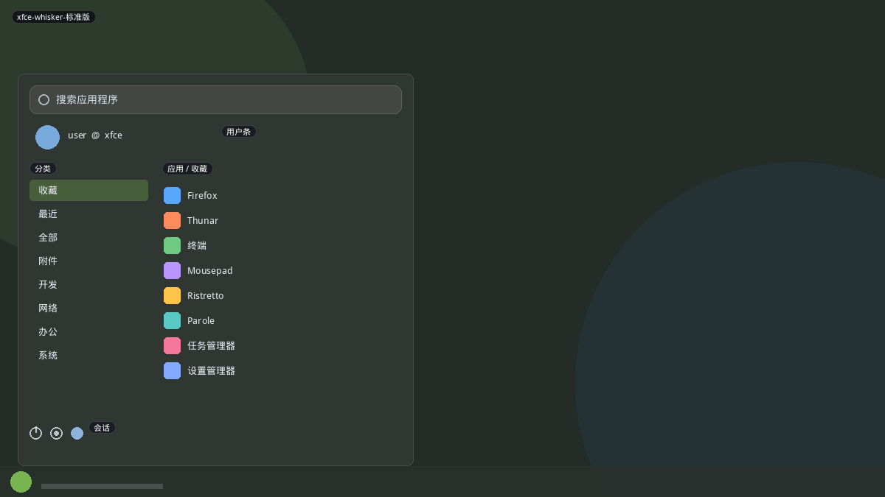

# Xfce

Xfce 默认是传统 Applications 级联菜单；社区主流替换是 **Whisker Menu**：带搜索、收藏、分类侧栏的弹窗。GNOME ArcMenu 的 Whisker 布局直接仿它，本仓库 `whisker` 已有实现。这里把官方插件和级联菜单拆开，避免和 Mint/Brisk 混成「又一个双栏」。

## 变体一览

| 名称 | 形态 | 现有布局 |
|------|------|----------|
| `xfce-whisker-标准版` | 用户条+分类+列表 | `whisker` |
| `xfce-applicationsmenu-传统级联` | 级联 | `kicker` |

---

## xfce-whisker-标准版



Graeme Gott 的面板插件。顶搜索（打开即聚焦），用户条（头像/名称），左分类（收藏、最近、全部、freedesktop 类），右应用列表，底会话按钮。可改分类在左或右、图标大小、是否显示描述。

```mermaid
flowchart TB
  Search["搜索"]
  User["用户条"]
  subgraph Body[""]
    Cat["分类（含收藏/最近）"]
    Apps["应用列表或网格"]
  end
  Session["会话按钮"]
  Search --> User --> Body --> Session
```

**功能设计**

- 收藏可拖拽排序；浏览时右键加入。
- 搜索匹配**名称+描述**，这是 Whisker 相对纯级联菜单的核心卖点。
- 可配外部命令：锁屏、注销、截图，不一定走 session DBus。
- 搜索动作（插件）：输入前缀触发网页搜索、手册页等，类似迷你 KRunner。

**可借鉴**

- 现有 `whisker` 已有用户条 + 分类。对照缺口：
  - 搜索动作（`man:`、`web:`）可接到 `SearchExtras.js`
  - 最近应用独立分类，不要和收藏混为一谈
  - 描述文字开关

---

## xfce-applicationsmenu-传统级联


xfce4-panel 自带 Applications Menu。体积小、无搜索框（可用单独的 Appfinder）。分类向右飞出。


**功能设计**

- 适合老习惯和低内存。Xfce 官方仍默认它，Whisker 是插件。
- 与 Kicker 几乎同构，皮肤是 GTK 而不是 Breeze。

**可借鉴**

- 复用 `kicker`。文档意义：Linux 传统菜单有两条线（Kicker / Xfce / GNOME Classic），不必各做一套。
